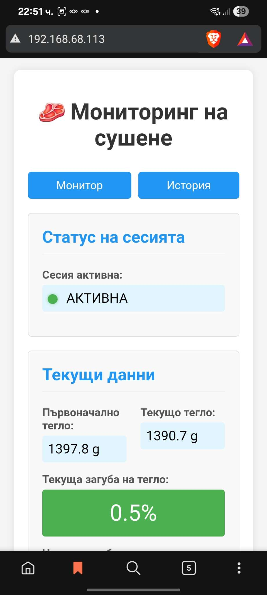
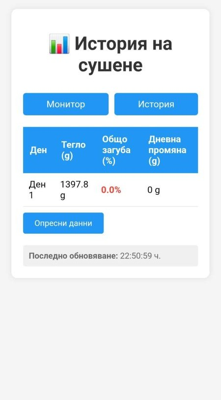

# Smart Scale for Meat Dryer (ESP32)

ESP32-based real-time smart scale for monitoring the meat drying / curing process.

The system tracks current weight, total weight loss (%), daily progress, and exposes a responsive web interface for live monitoring and historical analysis.
Designed as a real product prototype combining embedded firmware, persistent storage, and a lightweight web dashboard.

## Features

- Real-time weight readings (ESP32 + HX711 + load cell)
- Drying session tracking (initial weight, target loss %, current day)
- Auto daily record (1 record per 24h) + history view (up to ~60 days)
- OLED UI (SSD1306 128x64) + physical buttons
- Web UI:
  - Monitor page: `/`
  - History page: `/history`
- JSON endpoints:
  - Status: `/status/data`
  - History: `/history/data`


## Hardware

- ESP32 DevKit (configured as `esp32doit-devkit-v1`)
- HX711 module + load cell
- OLED SSD1306 (I2C, 0x3C, 128x64)
- 3 buttons (tare / unit & screen / start-stop)

### Pinout (default)

**HX711**
- `DOUT` -> GPIO **18**
- `SCK`  -> GPIO **19**

**Buttons**
- Tare / Record day: GPIO **33**
- Change units / screens: GPIO **25**
- Start / Stop session: GPIO **26**

**OLED I2C**
- SDA -> GPIO **21**
- SCL -> GPIO **22**

> Tip: Use `INPUT_PULLUP` wiring for buttons (button to GND), and keep HX711 wiring short.

## Project Structure (high level)

- `ScaleManager` – calibration, tare, unit conversion, persistent config
- `DryingSessionManager` – session lifecycle + stats (loss %, days remaining)
- `StorageManager` – session/history persistence
- `DisplayManager` – OLED screens (normal + drying live/stats/history)
- `WebServerManager` – web pages + JSON API

## Web Interface

### Live Monitoring

Shows active drying session status, initial weight, current weight and real-time weight loss percentage.



### Drying History

Displays day-by-day progress with total loss and daily delta for process analysis.




## Build & Flash (PlatformIO)

### Requirements
- VS Code + PlatformIO extension  
(or PlatformIO CLI)

### Build / Upload
```bash
pio run
pio run -t upload
pio device monitor
